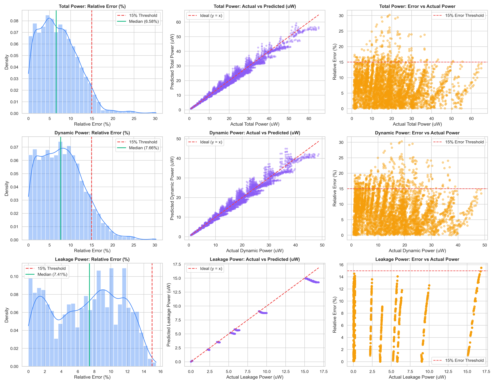
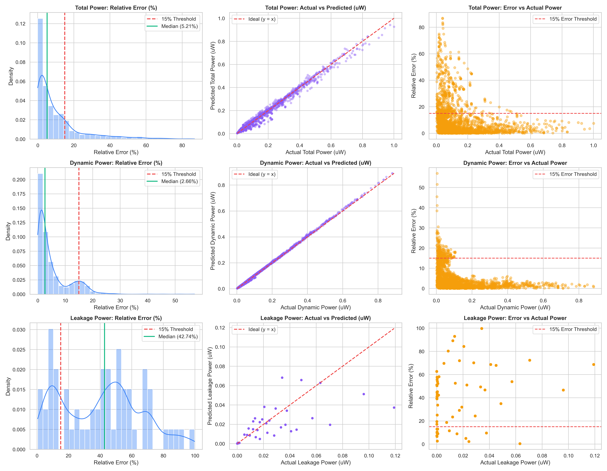
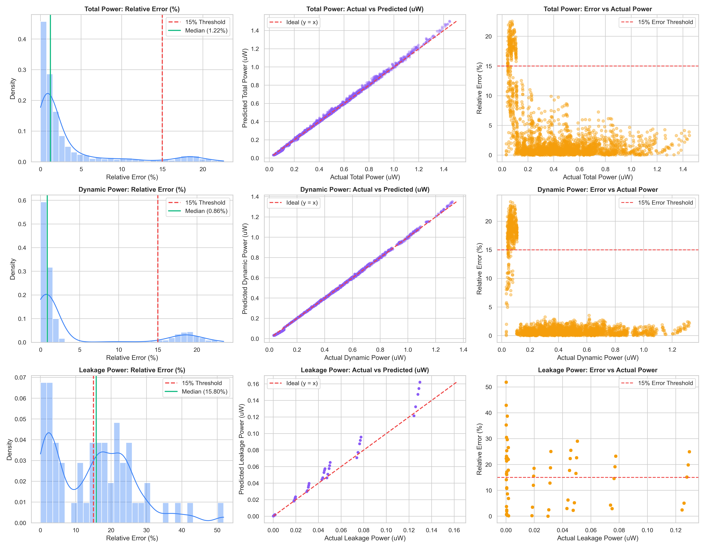
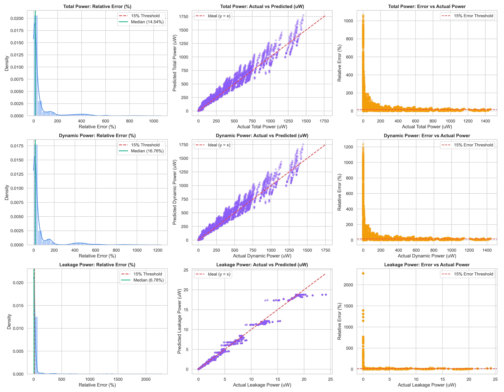
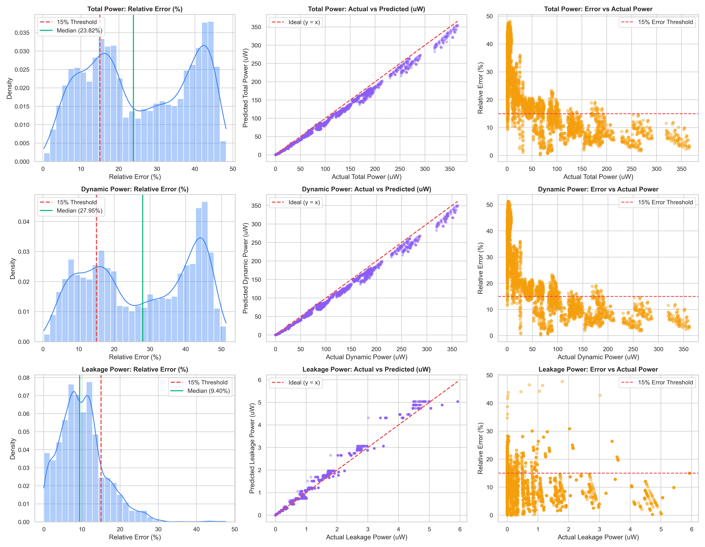

# Consolidated Power Prediction Evaluation Report

## Dataset: `filter`

| Target | MAE (uW) | R2 Score | sMAPE (%) | MAPE (>0.1uW) |
| :--- | :--- | :--- | :--- | :--- |
| Total Power | 1.2719 | 0.9783 | 7.29% | 7.12% |
| Dynamic Power | 1.1401 | 0.9748 | 8.26% | 8.06% |
| Leakage Power | 0.2603 | 0.9874 | 7.37% | 6.88% |

---

## Dataset: `encoder`

| Target | MAE (uW) | R2 Score | sMAPE (%) | MAPE (>0.1uW) |
| :--- | :--- | :--- | :--- | :--- |
| Total Power | 0.0101 | 0.9867 | 10.64% | 6.52% |
| Dynamic Power | 0.0033 | 0.9989 | 5.22% | 1.79% |
| Leakage Power | 0.0082 | 0.5146 | 45.28% | 68.69% |

---

## Dataset: `decoder`

| Target | MAE (uW) | R2 Score | sMAPE (%) | MAPE (>0.1uW) |
| :--- | :--- | :--- | :--- | :--- |
| Total Power | 0.0078 | 0.9985 | 3.60% | 1.87% |
| Dynamic Power | 0.0056 | 0.9993 | 4.51% | 1.26% |
| Leakage Power | 0.0040 | 0.9578 | 13.61% | 13.50% |

---

## Dataset: `dataset`

| Target | MAE (uW) | R2 Score | sMAPE (%) | MAPE (>0.1uW) |
| :--- | :--- | :--- | :--- | :--- |
| Total Power | 4.7774 | 0.9774 | 30.83% | 19.55% |
| Dynamic Power | 4.7644 | 0.9771 | 34.51% | 21.42% |
| Leakage Power | 0.0600 | 0.9925 | 17.27% | 7.38% |

---

## Dataset: `tests`

| Target | MAE (uW) | R2 Score | sMAPE (%) | MAPE (>0.1uW) |
| :--- | :--- | :--- | :--- | :--- |
| Total Power | 5.6850 | 0.9869 | 30.53% | 25.42% |
| Dynamic Power | 5.7197 | 0.9865 | 33.47% | 27.43% |
| Leakage Power | 0.0524 | 0.9879 | 9.82% | 8.92% |

---

